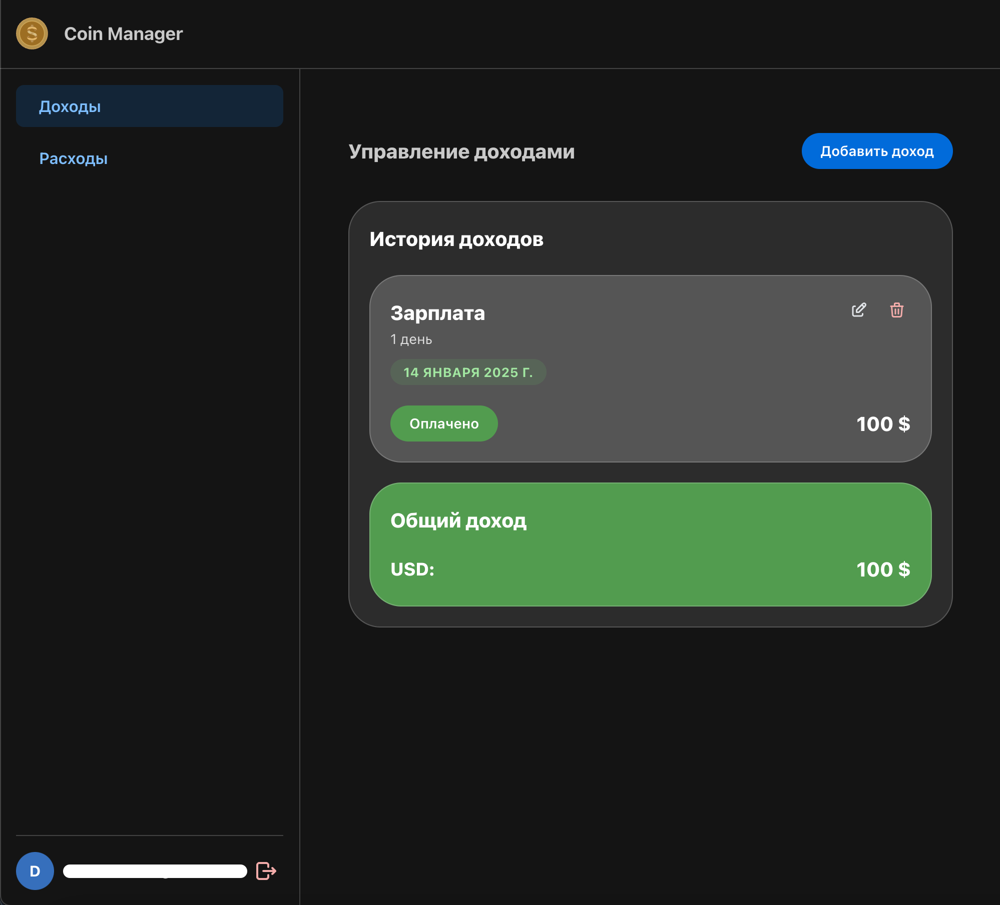
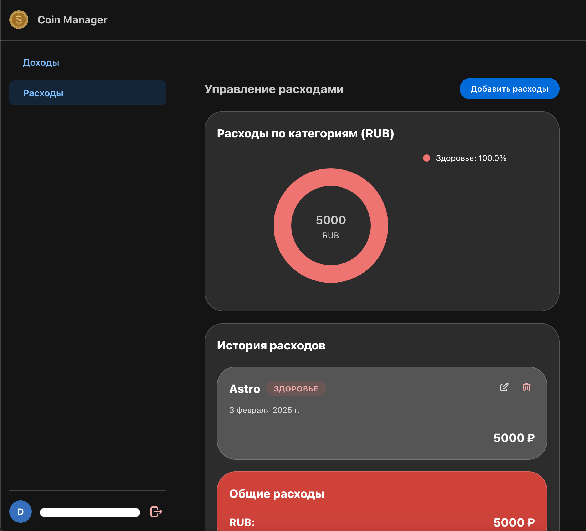

# Coin Manager - Expense Tracking App

A web application for tracking income and expenses, built with React, TypeScript, and Vite. The app supports multiple currencies and provides a user-friendly interface for managing your financial records.

## Features

- 💰 Track income and expenses
- 🌐 Multi-currency support
- 🔐 Secure authentication with Supabase
- 📊 Financial period management
- 📱 Responsive design
- 🎨 Clean and intuitive interface

## Screenshots

### Income Form


### Expense Form


### Incomes



### Expenses



## Tech Stack

- React 19
- TypeScript
- Vite
- Supabase (Authentication & Database)
- Mantine UI

## Getting Started

1. Clone the repository

```bash
git clone <repository-url>
cd coin-manager
```

2. Install dependencies

```bash
bun install
```

3. Set up environment variables

```bash
VITE_SUPABASE_URL=your_supabase_url
VITE_SUPABASE_ANON_KEY=your_supabase_anon_key
```

4. Start the development server

```bash
bun run dev
```

## Building for Production

To create a production build:

```bash
bun run build
```

## License

This project is licensed under the GNU General Public License - see the LICENSE file for details.
